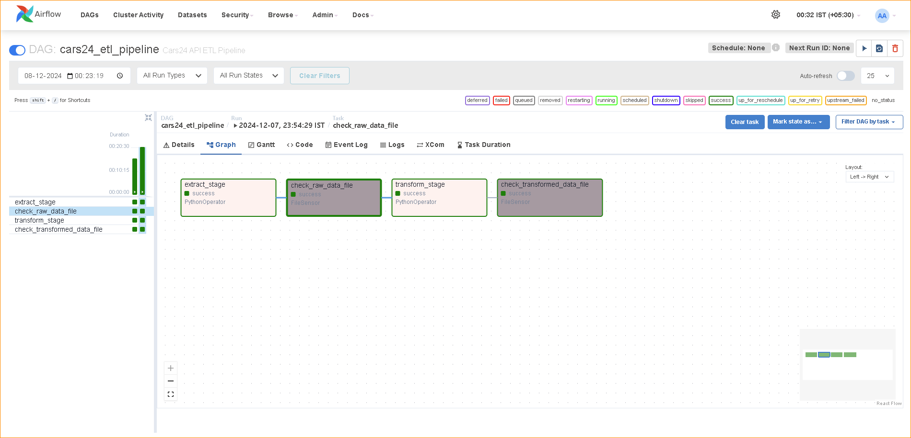

- An ETL pipeline (Extract, Transform, Load) is a structured process used to gather data from multiple sources, clean and format it, and load it into a central system like a database or data warehouse. It ensures data is accurate, consistent, and ready for analysis or reporting, automating workflows to handle large volumes of data efficiently.

- This ETL Pipeline extracts used car price data from Cars24.com, Transform & Load in a cloud
- I've used Airflow in a Docker Container to automate the Process.

- docker compose down
- docker-compose build --no-cache && docker-compose up : To run this ETL pipeline
- docker exec -it cars24_etl_pipeline bash
- docker system prune -a
